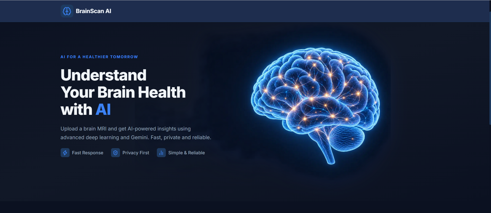
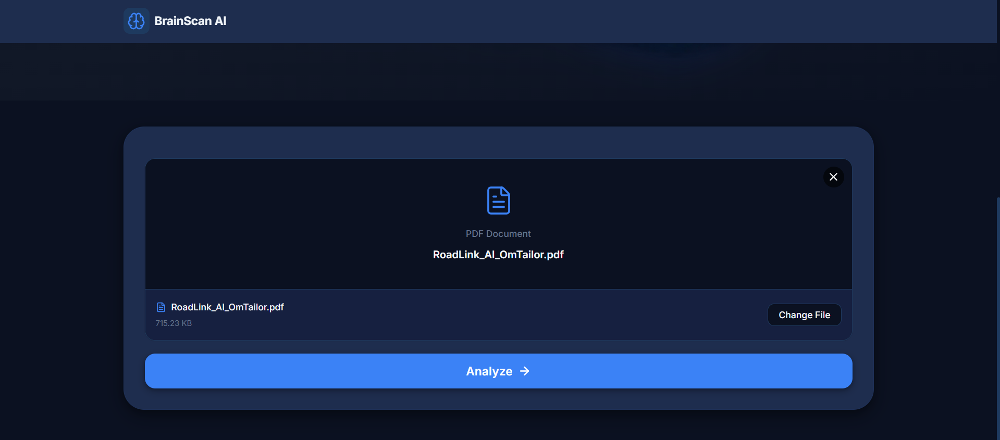
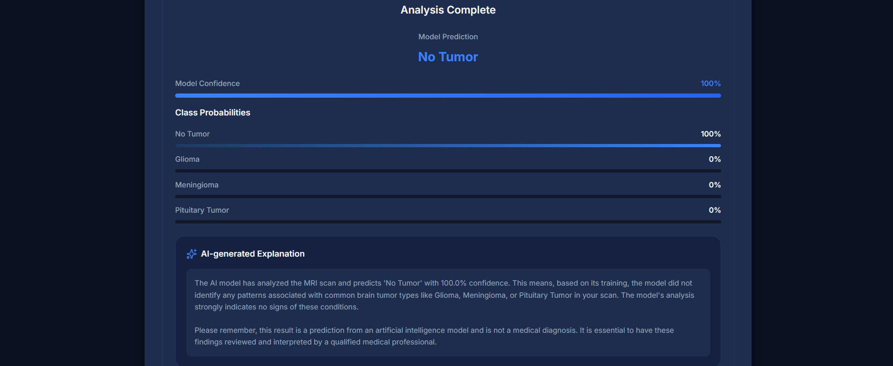

# BrainScan AI

AI-assisted brain MRI classification using a React frontend, FastAPI backend, a trained SmallCNN model, and Google Gemini.

> **Medical disclaimer:** BrainScan AI is an educational and research prototype. It does not provide a medical diagnosis, prognosis, or treatment recommendation. Always consult a qualified medical professional.

## Preview








## Features

- Upload brain MRI files using drag and drop or a file picker
- Support for JPG, JPEG, PNG, and PDF files
- Maximum upload size of 20 MB
- MRI suitability validation using Google Gemini
- Four-class brain tumor classification using SmallCNN
- Confidence score and class probability breakdown
- Grad-CAM visualization for model interpretability
- Gemini-generated plain-language explanations
- AI chat endpoint for brain tumor-related questions
- Responsive React interface for mobile and desktop
- Light and dark theme support
- Accessible controls with keyboard navigation and ARIA labels
- Interactive Swagger and ReDoc API documentation
- In-memory file processing with no database or file storage

## Classification Classes

The model predicts one of the following classes:

| Class ID | Class           |
| -------: | --------------- |
|        0 | No Tumor        |
|        1 | Glioma          |
|        2 | Meningioma      |
|        3 | Pituitary Tumor |

## Application Architecture

```text
React Frontend
      |
      | POST /api/analyze
      v
FastAPI Backend
      |
      +-- Upload validation
      |     Extension, MIME type, file size, and image decoding
      |
      +-- Gemini MRI validation
      |     Confirms whether the upload is a suitable brain MRI
      |
      +-- Image preparation
      |     JPEG/PNG decoding or first usable PDF image extraction
      |
      +-- SmallCNN inference
      |     Resize, normalize, classify, and calculate probabilities
      |
      +-- Grad-CAM visualization
      |     Generates a model attention overlay
      |
      +-- Gemini explanation
      |     Produces a plain-language explanation
      |
      v
JSON response displayed by the React UI
```

### Responsibility Split

| Component | Responsibility                                                       |
| --------- | -------------------------------------------------------------------- |
| SmallCNN  | Tumor classification, confidence, and class probabilities            |
| Gemini    | MRI validation, explanation generation, and chat responses           |
| FastAPI   | Upload handling, orchestration, API responses, and error handling    |
| React     | Upload workflow, loading states, results, visualizations, and themes |

## Technology Stack

### Frontend

- React 19
- Vite
- JavaScript
- CSS
- Lucide React

### Backend

- Python
- FastAPI
- Uvicorn
- PyTorch
- Torchvision
- Pillow
- Pydantic
- Google Gemini API

## Project Structure

```text
Brain_Tumour_Classification/
├── assets/
│   ├── ai_response_!.png
│   ├── dashboard.png
│   ├── tumour_analysis.png
│   └── user_input.png
│
├── backend/
│   ├── app/
│   │   ├── api/
│   │   │   └── routes/
│   │   │       ├── analyze.py
│   │   │       ├── chat.py
│   │   │       ├── health.py
│   │   │       └── validate_mri.py
│   │   ├── core/
│   │   │   ├── config.py
│   │   │   └── model_config.py
│   │   ├── models/
│   │   │   └── cnn_model.py
│   │   ├── schemas/
│   │   │   ├── analysis.py
│   │   │   ├── chat.py
│   │   │   └── validation.py
│   │   ├── services/
│   │   │   ├── cnn_service.py
│   │   │   ├── gemini_service.py
│   │   │   ├── mri_validator.py
│   │   │   └── pdf_extractor.py
│   │   └── utils/
│   │       └── file_handler.py
│   ├── models/
│   │   └── cnn_baseline_best.pth
│   ├── requirements.txt
│   └── README.md
│
├── frontend/
│   ├── public/
│   ├── src/
│   │   ├── components/
│   │   ├── services/
│   │   ├── styles/
│   │   ├── App.jsx
│   │   └── main.jsx
│   ├── package.json
│   └── vite.config.js
│
└── README.md
```

## Requirements

Install the following before running the project:

- Python 3.10 or newer
- Node.js 18 or newer
- npm
- A Google Gemini API key
- The included CNN checkpoint

## Backend Setup

Open a terminal in the `backend` directory:

```bash
cd backend
```

### Create a virtual environment

#### Windows PowerShell

```powershell
python -m venv venv
.\venv\Scripts\Activate.ps1
```

#### macOS or Linux

```bash
python3 -m venv venv
source venv/bin/activate
```

### Install Python dependencies

```bash
pip install -r requirements.txt
```

### Configure environment variables

Create a file named `.env` inside `backend/`:

```env
GEMINI_API_KEY=your_gemini_api_key

GEMINI_MODEL=gemini-2.5-flash
MAX_UPLOAD_SIZE_MB=20
MODEL_PATH=models/cnn_baseline_best.pth
DEVICE=
ALLOWED_ORIGINS=http://localhost:3000,http://localhost:5173
HOST=0.0.0.0
PORT=8000
```

The CNN checkpoint should be available at:

```text
backend/models/cnn_baseline_best.pth
```

### Start the backend

Run this command from the `backend/` directory:

```bash
uvicorn app.main:app --reload --host 0.0.0.0 --port 8000
```

The backend will be available at:

```text
http://localhost:8000
```

## Frontend Setup

Open a second terminal in the `frontend` directory:

```bash
cd frontend
npm install
```

Create a `.env` file in the `frontend/` directory:

```env
VITE_API_BASE_URL=http://localhost:8000
```

Start the frontend development server:

```bash
npm run dev
```

The frontend will be available at:

```text
http://localhost:5173
```

## Frontend Commands

```bash
npm run dev       # Start the development server
npm run build     # Create a production build
npm run preview   # Preview the production build
npm run lint      # Run ESLint
```

## API Endpoints

### Health Check

```http
GET /health
```

Example response:

```json
{
  "status": "ok",
  "model_loaded": true,
  "device": "cpu"
}
```

### Analyze an MRI

```http
POST /api/analyze
Content-Type: multipart/form-data
```

Form field:

```text
file
```

Example request:

```bash
curl -X POST http://localhost:8000/api/analyze \
  -F "file=@/path/to/brain_mri.jpg"
```

Example successful response:

```json
{
  "success": true,
  "valid_mri": true,
  "prediction": {
    "class_id": 1,
    "class_name": "Glioma",
    "confidence": 0.94
  },
  "probabilities": {
    "No Tumor": 0.01,
    "Glioma": 0.94,
    "Meningioma": 0.03,
    "Pituitary Tumor": 0.02
  },
  "explanation": "The CNN model classified this MRI scan as Glioma...",
  "grad_cam_image": "data:image/png;base64,..."
}
```

### Validate an MRI

```http
POST /api/validate-mri
Content-Type: multipart/form-data
```

Example request:

```bash
curl -X POST http://localhost:8000/api/validate-mri \
  -F "file=@/path/to/brain_mri.jpg"
```

Example response:

```json
{
  "valid": true,
  "message": "Valid brain MRI detected.",
  "reason": "The image appears to be a brain MRI."
}
```

### Chat

```http
POST /api/chat
Content-Type: application/json
```

Example request:

```bash
curl -X POST http://localhost:8000/api/chat \
  -H "Content-Type: application/json" \
  -d '{"message":"What is a glioma?"}'
```

Example response:

```json
{
  "response": "A glioma is a type of tumor that develops from glial cells in the brain."
}
```

## Supported File Formats

| Format | MIME type           | Maximum size |
| ------ | ------------------- | -----------: |
| JPG    | `image/jpeg`      |        20 MB |
| JPEG   | `image/jpeg`      |        20 MB |
| PNG    | `image/png`       |        20 MB |
| PDF    | `application/pdf` |        20 MB |

For PDF files, the backend extracts the first usable image it finds. If no decodable image is found, the request is rejected and the user is asked to upload the scan as an image.

## CNN Model Details

| Property            | Value                                    |
| ------------------- | ---------------------------------------- |
| Architecture        | SmallCNN with three convolutional blocks |
| Input size          | `224 x 224` pixels                     |
| Input channels      | RGB                                      |
| Number of classes   | 4                                        |
| Checkpoint          | `cnn_baseline_best.pth`                |
| Validation accuracy | 95.19% at epoch 9                        |

### Preprocessing

```python
Resize((224, 224))
ToTensor()
Normalize(
    mean=[0.485, 0.456, 0.406],
    std=[0.229, 0.224, 0.225]
)
```

The class order is fixed and must match the checkpoint:

```python
[
    "No Tumor",
    "Glioma",
    "Meningioma",
    "Pituitary Tumor"
]
```

## Processing Flow

1. The frontend validates the selected file.
2. The file is uploaded to `POST /api/analyze`.
3. The backend checks the extension, MIME type, size, and file contents.
4. Gemini checks whether the upload is a suitable brain MRI.
5. Invalid uploads are rejected before CNN inference.
6. The backend extracts and preprocesses the image.
7. SmallCNN predicts the tumor class.
8. Class probabilities and confidence are calculated.
9. Grad-CAM generates an attention visualization.
10. Gemini produces a plain-language explanation.
11. The result is returned to the React frontend.

## Privacy

- No database is used.
- No user accounts are required.
- No conversation history is stored.
- Uploaded files are processed in memory.
- Uploaded files are not intentionally written to disk.
- The Gemini API may process content sent to it according to Google's API terms and privacy policies.

Do not upload identifiable patient data to a development or third-party service without appropriate authorization and safeguards.

## Medical Safety

This project is not a clinical diagnostic system.

- The confidence score is a model softmax score.
- Confidence is not a cancer probability.
- A prediction is not a confirmed diagnosis.
- The model may produce incorrect results.
- Gemini explanations do not override the CNN prediction.
- Results must be reviewed by a qualified medical professional.
- The application must not be used as a substitute for medical evaluation.

## Troubleshooting

### The backend starts but analysis returns `503`

Check the health endpoint:

```text
http://localhost:8000/health
```

If `model_loaded` is `false`, verify that this file exists:

```text
backend/models/cnn_baseline_best.pth
```

### The frontend cannot connect to the backend

Verify that:

1. The backend is running on port `8000`.
2. The frontend `.env` contains:

```env
VITE_API_BASE_URL=http://localhost:8000
```

3. The backend `ALLOWED_ORIGINS` includes:

```env
http://localhost:5173
```

### Gemini validation or explanation fails

Verify that:

```env
GEMINI_API_KEY=your_gemini_api_key
```

is present in `backend/.env`.

The CNN result may still be returned with a fallback explanation when Gemini is unavailable during the explanation step.

### PDF upload fails

The PDF must contain an image that Pillow can decode. For best results, export the MRI as JPG or PNG and upload the image directly.

## API Documentation

When the backend is running, interactive API documentation is available at:

- Swagger UI: http://localhost:8000/docs
- ReDoc: http://localhost:8000/redoc

## Project Status

This project is an educational prototype demonstrating:

- Deep-learning image classification
- FastAPI model serving
- React-based medical imaging workflows
- Generative AI integration
- File validation and secure in-memory processing
- Model interpretability with Grad-CAM

The project is not intended for clinical deployment without substantial additional validation, security controls, compliance review, and medical oversight.
